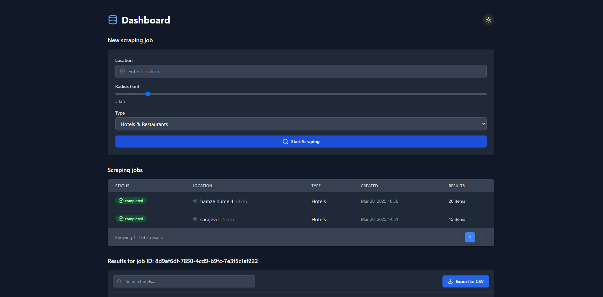
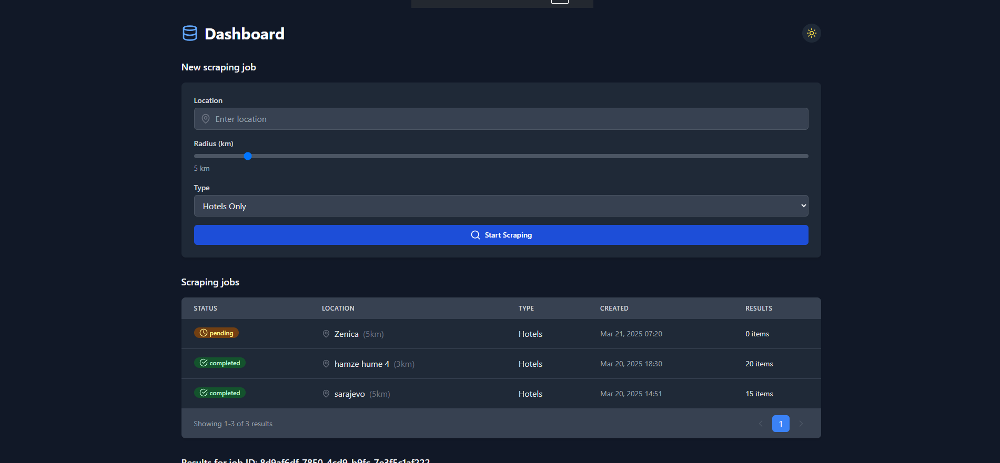
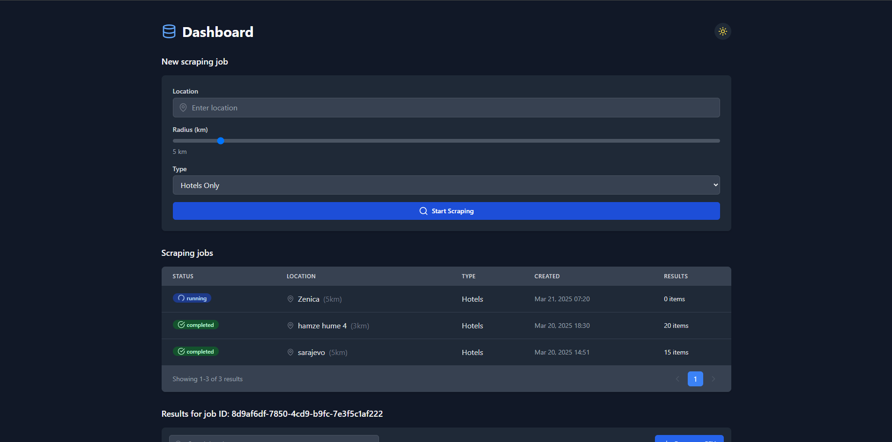
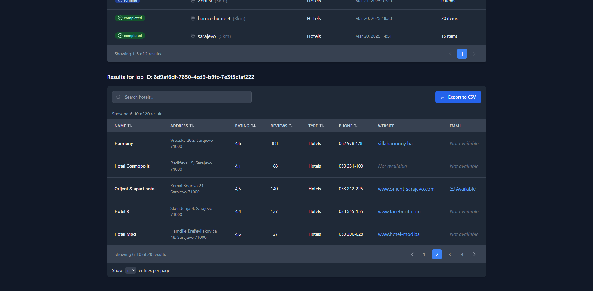
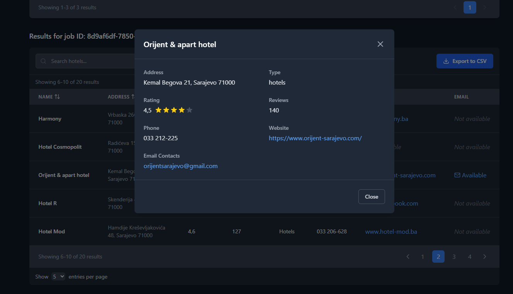

# Google Maps Scraper

A web application for scraping hotel and restaurant data from Google Maps based on location and radius.

## Overview

This application allows users to scrape business information from Google Maps within a specified radius of a location. It's built with React TypeScript for the frontend and Python for the backend scraping functionality.

## Features

- **Location-based scraping**: Enter any location to start scraping
- **Radius selection**: Set a search radius (default 5km)
- **Business type filtering**: Choose between "Hotels Only" or "Hotels & Restaurants"
- **Job management**: View, track, and manage multiple scraping jobs
- **Results viewing**: Browse through scraped data with pagination
- **Data export**: Export results to CSV for further analysis
- **Detailed business information**:
  - Name
  - Address
  - Rating
  - Number of reviews
  - Phone number
  - Website URL
  - Email contact (when available)

## Installation

### Prerequisites
- Node.js (v16 or higher)
- Python (v3.8 or higher)
- pip (Python package manager)
- Git

### Backend Setup
1. Clone the repository
   ```
   git clone https://github.com/kenagt/GoogleMapsWebScraper.git
   cd backend
   ```

2. Create and activate a Python virtual environment
   ```
   python -m venv venv
   source venv/bin/activate  # On Windows: venv\Scripts\activate
   ```

3. Install Python dependencies
   ```
   pip install -r requirements.txt
   ```

### Frontend Setup
1. Navigate to the frontend directory
   ```
   cd src
   ```

2. Install Node.js dependencies
   ```
   npm install
   ```

3. Build the frontend assets
   ```
   npm run build
   ```

4. Access the application at `http://localhost:5173`

### Running the Application
1. Start the backend server
   ```
   cd backend
   python app.py
   ```

2. In a new terminal, start the frontend development server
   ```
   cd src
   npm run dev
   ```

3. Access the api at `http://localhost:5000`

## User Interface

### Dashboard

The main dashboard provides:
- Form to create new scraping jobs
- Table of recent and ongoing scraping jobs with status indicators
- Pagination for job listings

### New Scraping Job

To create a new scraping job:
1. Enter a location
2. Adjust the radius (default: 5km)
3. Select the type of businesses to scrape
4. Click "Start Scraping"

### Job Status Tracking

Each job displays one of the following statuses:
- **Pending**: Job is in queue
- **Running**: Actively scraping data
- **Completed**: Scraping finished successfully

### Results Viewing

- View all scraped results in a sortable table
- Click on a business name to see detailed information
- Navigate between pages of results
- Adjust entries shown per page
- Export all results to CSV

## Technical Information

- **Frontend**: React TypeScript
- **Backend**: Python
- **Data Source**: Google Maps
- **Unique Job IDs**: Each scraping operation receives a unique identifier

## Troubleshooting

- **Google Maps API Rate Limiting**: If scraping stops working, you may have hit Google's rate limits. Try using a different IP or waiting a few hours.
- **Browser Driver Issues**: For selenium-based scraping, ensure you have the correct chromedriver version matching your Chrome browser.
- **Database Connection Errors**: Verify your database credentials in the `.env` file.
- **Port Already in Use**: Change the port settings in the configuration if 3000 (frontend) or 5000 (backend) are already in use.

## Usage Examples

- Find all hotels within 5km of Sarajevo
- Gather contact information for restaurants near a specific location
- Compare ratings and reviews for hospitality businesses in an area

## Notes

- Scraping times will vary based on the number of businesses in the selected area
- Some business information may not be available (shown as "Not available" in results)


## Running app






